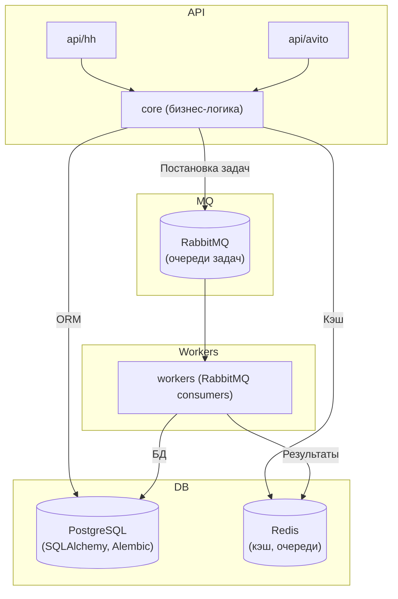

# Архитектура HR-платформы

## Общая схема

## Основные компоненты

- **api/** — REST API для интеграций (hh, avito и др.)
- **core/** — бизнес-логика, сервисы, обработчики
- **workers/** — асинхронные задачи, обработка очередей RabbitMQ
- **database/** — модели, репозитории, миграции (SQLAlchemy, Alembic)
- **redis_manager/** — работа с Redis (кэш, очереди, хранение сессий)
- **config/** — конфигурация, переменные окружения
- **ai/** — модули искусственного интеллекта (поиск, обработка резюме)
- **utils/** — вспомогательные функции, декораторы, логирование

## Взаимодействие компонентов

- API принимает запросы, валидирует, ставит задачи в RabbitMQ
- Workers слушают очереди RabbitMQ, обрабатывают задачи, пишут результаты в Redis/БД
- PostgreSQL — основное хранилище данных (ORM: SQLAlchemy, миграции: Alembic)
- Redis — кэш, хранение сессий, быстрые очереди
- Все параметры — через переменные окружения (.env)

## Принципы архитектуры

- **Модульность**: каждый компонент — отдельный модуль
- **Чистая архитектура**: разделение бизнес-логики, инфраструктуры, API, интеграций
- **12-factor app**: конфигурация через env, отсутствие состояния на файловой системе контейнера
- **Масштабируемость**: легко добавлять новые интеграции, очереди, сервисы
- **Логирование**: структурированное логирование, поддержка разных уровней

## Используемые технологии

- **PostgreSQL** — основная БД
- **SQLAlchemy** — ORM
- **Alembic** — миграции
- **Redis** — кэш, очереди, хранение сессий
- **RabbitMQ** — очереди задач, асинхронные воркеры
- **Docker, docker-compose** — контейнеризация
- **Jenkins** — CI/CD
- **pytest** — тестирование
- **MkDocs** — документация 